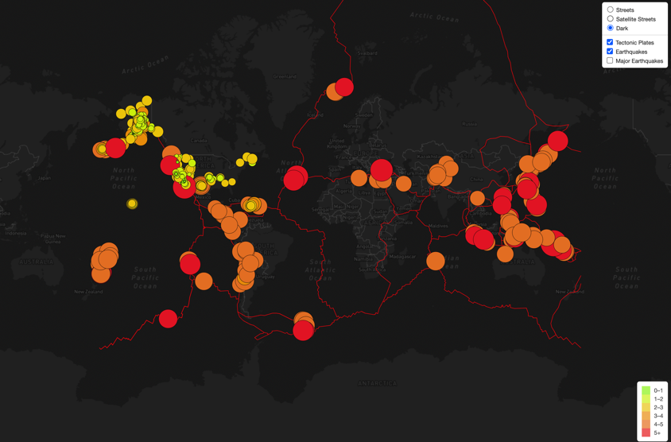
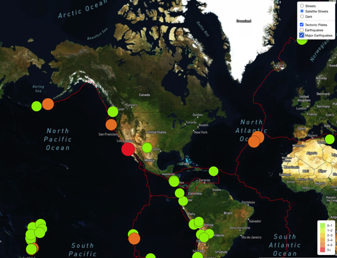
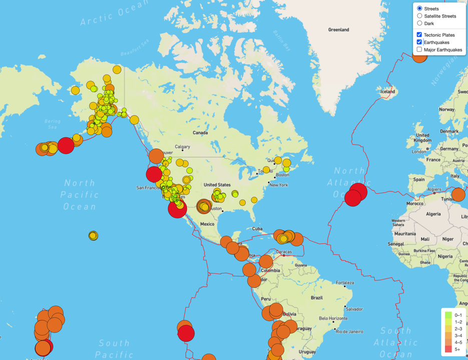

# Mapping_Earthquakes

## Purpose 
The purpose of this project is to visually show the differences between the magnitudes of earthquakes all over the world for the last seven days.

## Approach 
- Use JavaScript and D3.js library to retrieve coordinates and magnitudes of earthquakes from GeoJSON data. 
- Use Leaflet library to plot data on a Mapbox map through API request. 
- Create interactivity for the earthquake data 

#### Dark 

#### Satellite

#### Streets
